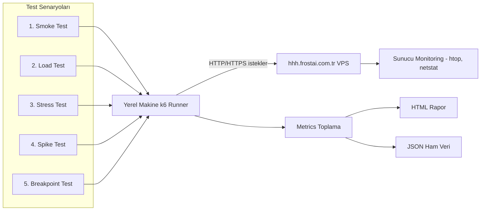
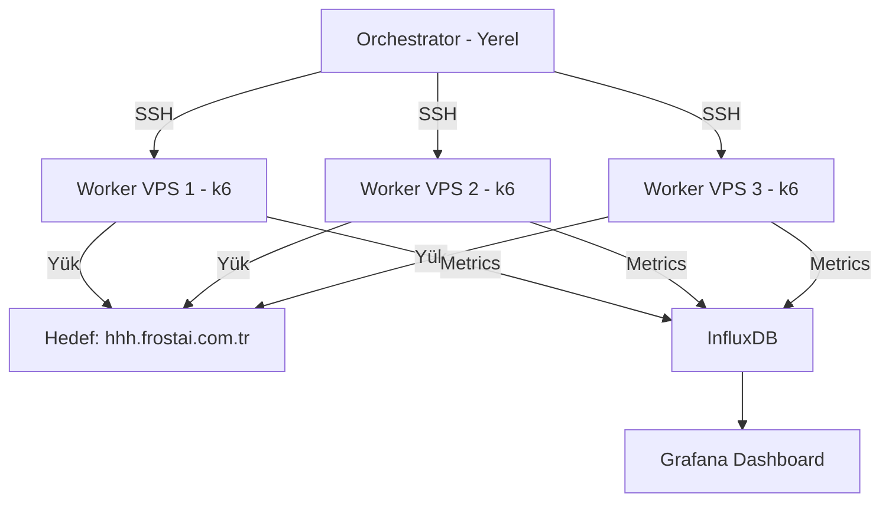

# 🎯 Load Testing Sistemi — Detaylı Plan

**Hedef:** `hhh.frostai.com.tr` (kullanıcıya ait VPS)
**Amaç:** Agresif stress test — sunucunun kırılma noktasını (breakpoint) bulmak
**Araç:** [k6](https://k6.io/) (Grafana tarafından geliştirilen modern load testing aracı)

---

## ⚠️ Yasal Uyarılar (ÖNEMLİ)

1. **Sadece sahibi olduğunuz veya yazılı izin aldığınız sistemlere test yapın.** TCK 243/244 (bilişim sistemlerine izinsiz erişim / engelleme) suçtur.
2. **VPS sağlayıcınıza haber verin.** Hetzner, DigitalOcean, AWS gibi sağlayıcılar yüksek trafiği DDoS zannedip hesabı askıya alabilir.
3. **Cloudflare / WAF aktifse** öncelikle whitelist yapılmalı, aksi halde IP'niz bloklanır.
4. **Test saatini seçin.** Canlı kullanıcı olan saatlerde yapmayın; gece / bakım penceresinde yapın.
5. **Yakın izleme.** Sunucuda `htop`, `netstat`, log takibi yapın; gerektiğinde acil durdurabilin.

---

## 🏗️ Sistem Mimarisi



---

## 📁 Proje Dosya Yapısı

```
botnet/
├── plan.md                          # Bu dosya
├── README.md                        # Kurulum + kullanım rehberi
├── config/
│   └── config.js                    # Ortak URL, thresholds, options
├── scenarios/
│   ├── 01-smoke.js                  # 1 VU, 30sn — bağlantı testi
│   ├── 02-load.js                   # 100 VU, 5dk — normal yük
│   ├── 03-stress.js                 # Aşamalı 100→500→1000 VU
│   ├── 04-spike.js                  # Ani 2000 VU şoku
│   └── 05-breakpoint.js             # Sonsuz artan yük (kırılma bulmak)
├── utils/
│   ├── endpoints.js                 # Test edilecek endpoint listesi
│   └── helpers.js                   # Yardımcı fonksiyonlar (auth, headers)
├── reports/                         # Sonuçlar (otomatik oluşur)
│   └── .gitkeep
├── scripts/
│   ├── run-smoke.bat                # Windows: smoke test
│   ├── run-load.bat
│   ├── run-stress.bat
│   ├── run-spike.bat
│   ├── run-breakpoint.bat
│   └── run-all.bat                  # Hepsini sıralı çalıştır
└── monitoring/
    └── server-monitor.sh            # Sunucuda çalışacak monitoring
```

---

## 🧪 Test Senaryoları

### 1️⃣ Smoke Test (`01-smoke.js`)
**Amaç:** Site ayakta mı, k6 doğru çalışıyor mu?
- **VU (Virtual User):** 1
- **Süre:** 30 saniye
- **Beklenen:** %100 başarı, <500ms yanıt süresi

### 2️⃣ Load Test (`02-load.js`)
**Amaç:** Normal beklenen yük altında performans
- **VU:** 100 (ramp-up: 1dk, sabit: 3dk, ramp-down: 1dk)
- **Süre:** 5 dakika toplam
- **Thresholds:** p95 < 2s, error rate < %1

### 3️⃣ Stress Test (`03-stress.js`)
**Amaç:** Yüksek yükte davranış — kademeli artış
- **Stages:**
  - 0→100 VU (2dk)
  - 100→500 VU (3dk)
  - 500→1000 VU (3dk)
  - 1000 VU sabit (5dk)
  - 1000→0 (2dk)
- **Süre:** ~15 dakika
- **Not:** Sunucu CPU/RAM/network limitlerini görürüz

### 4️⃣ Spike Test (`04-spike.js`)
**Amaç:** Ani trafik patlamasına dayanıklılık (viral olma, DDoS benzeri)
- **Stages:**
  - 10 VU (baseline, 1dk)
  - **Aniden 2000 VU** (10 saniye içinde)
  - 2000 VU sabit (2dk)
  - 10 VU'ya düşüş (1dk)
- **Süre:** ~5 dakika

### 5️⃣ Breakpoint Test (`05-breakpoint.js`) ⚠️ AGRESİF
**Amaç:** **Sunucunun kırılma noktasını bulmak** (sizin ana isteğiniz)
- **Executor:** `ramping-arrival-rate`
- **Başlangıç:** 100 req/s
- **Artış:** Her 30 saniyede +100 req/s
- **Bitiş koşulu:** Error rate %10'u aşarsa VEYA p95 > 10s (otomatik abort)
- **Maksimum:** 5000 req/s (güvenlik tavanı)
- **Beklenen çıktı:** "Sunucunuz X req/s'de kırıldı"

---

## 📊 Ölçülecek Metrikler

| Metrik | Anlamı | Kabul Edilebilir |
|--------|--------|------------------|
| `http_req_duration` | İstek yanıt süresi | p95 < 2s |
| `http_req_failed` | Başarısız istek oranı | < %1 |
| `http_reqs` | Toplam istek sayısı | Yüksek olmalı |
| `vus` | Anlık aktif kullanıcı | Hedefe ulaşmalı |
| `iterations` | Tamamlanan senaryo sayısı | — |
| `data_received/sent` | Ağ trafiği | — |

---

## 🔧 Teknik Detaylar

### k6 Kurulumu (Windows)
```powershell
# Chocolatey ile
choco install k6

# VEYA winget
winget install k6

# VEYA manuel: https://dl.k6.io/msi/k6-latest-amd64.msi
```

### Örnek Çalıştırma
```bash
k6 run scenarios/03-stress.js
k6 run --out json=reports/stress.json scenarios/03-stress.js
```

### HTML Rapor
[k6-reporter](https://github.com/benc-uk/k6-reporter) kullanacağız — `handleSummary()` fonksiyonu ile otomatik HTML export.

---

## 🌍 Dağıtık Test (Faz 2 — Opsiyonel)

Tek makineden 5000+ req/s göndermek zor. Gerekirse:

**Seçenek A: k6 Cloud** (paralı ama kolay)
- k6.io üzerinden bulut worker'lar

**Seçenek B: Kendi Dağıtık Sistemimiz**
- 3-5 ucuz VPS (Contabo, Hetzner Cloud CX11 ~3€/ay)
- Her VPS'te k6 çalıştır
- SSH orchestration script'i (`orchestrator.sh`) ile eş zamanlı başlatma
- Sonuçları merkezi InfluxDB + Grafana'ya toplama



---

## 🚨 Güvenlik Kontrolleri

Her senaryoda:
- ✅ Hedef URL config'den okunur (yanlış siteye gitmemesi için)
- ✅ `abortOnFail` — kritik hata olursa test durur
- ✅ Sunucu tarafında CPU %95'i aşarsa manuel durdurma
- ✅ `.env` dosyası ile hassas veri (auth token) yönetimi

---

## 📅 Uygulama Adımları (Code Mode'da)

1. Proje klasör yapısını oluştur
2. `config/config.js` — merkezi konfigürasyon
3. `utils/endpoints.js` — test edilecek path'ler
4. 5 test senaryosunu yaz
5. HTML reporter entegre et
6. `.bat` çalıştırma script'lerini oluştur
7. `README.md` — adım adım kullanım rehberi
8. Kullanıcı k6'yı kursun ve **önce smoke test** çalıştırsın
9. Sırasıyla load → stress → spike → breakpoint

---

## ❓ Sizden Cevap Bekleyenler

Detaylı plana geçmeden önce son 2 küçük soru (README'ye ekleyeceğim):

1. **Sitede özel endpoint'ler var mı?** (Örn: `/api/login`, `/api/products`, `/dashboard`)
   Yoksa sadece `/` (anasayfa) test edilir.
2. **Kimlik doğrulama gerekiyor mu?** (Login sonrası test edilecek sayfalar var mı?)